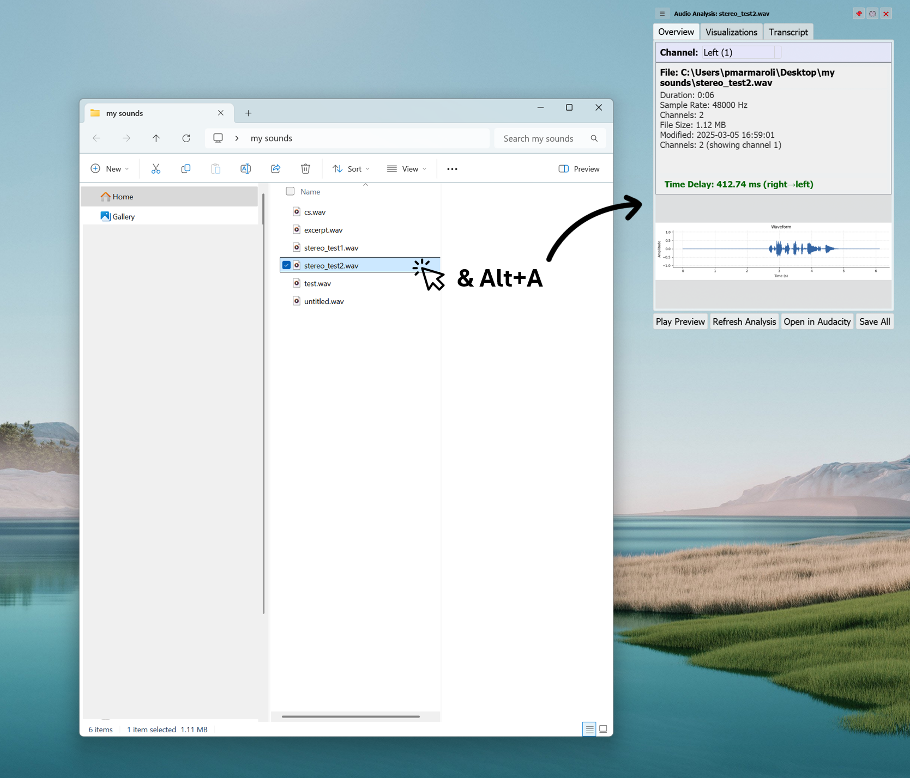
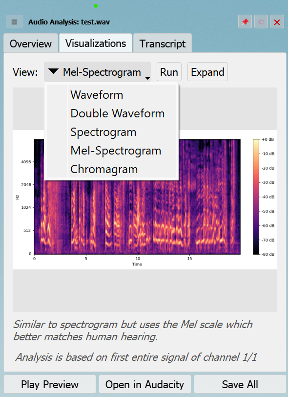

# Audio Tooltip

Audio Tooltip is a desktop application that gives you quick information about audio files without needing to open complex audio editing software.

## What It Does

The app runs quietly in your system tray (the small icons area near your clock) and gives you instant information about audio files with a simple keyboard shortcut (Alt+A). When you select an audio file and press this shortcut, a small window (tooltip) pops up showing:

1. Basic information about the audio file (length, format, etc.)
2. Visual representations of the sound (waveforms and spectrograms)
3. Written transcript of any speech in the audio (like subtitles)

## How You Use It

There are several ways to analyze audio files:

1. Select a file in Windows Explorer and press Alt+A
2. Right-click the app's icon in the system tray and select "Analyze File..."
3. Open the drop target window and drag-and-drop audio files onto it

## Main Features

- **Overview**: Basic information and waveform display.
- **Visualizations**: Various audio visualizations (spectrogram, mel-spectrogram, chromagram, double waveform)
- **Full Audio Transcription**: Speech-to-text via Azure Speech Services with continuous recognition for files of any length
- **Simple interface**: Everything is organized in tabs for easy navigation

Additional controls:

- Play a short preview of the audio
- Open the full file in Audacity or your default audio player
- Pin the tooltip to keep it visible
- Switch between channels for multi-channel audio
- Save analysis results to files

## Why It's Useful

We hope this tool can be helpful for:

- Audio engineers wanting quick insights into sound files
- Podcast editors checking audio quality before detailed editing
- Musicians analyzing sound characteristics
- Anyone who works with audio and needs quick information without opening large programs

## Application Interface




## Project Structure

```
audio-analyzer/
│
├── core/                      # Core analysis functionality
│   ├── audio_analyzer.py      # Audio loading and analysis
│   ├── audio_features.py      # Feature extraction
│   └── audio_playback.py      # Audio playback functionality
│
├── ui/                        # User interface components
│   ├── tooltip.py             # Main tooltip display
│   ├── settings_dialog.py     # Settings configuration
│   └── progress_dialog.py     # Progress indicators
│
├── utils/                     # Utility functions
│   ├── file_utils.py          # File handling utilities
│   └── logging_utils.py       # Logging configuration
│
├── resources/                 # Application resources
│   └── icons/                 # Application icons
│
├── main.py                    # Application entry point
├── README.md                  # Project documentation
└── requirements.txt           # Dependencies
```

## Installation

### Option 1: Download the Pre-built Release

1. Go to the [Releases page](https://github.com/pmarmaroli/AudioTooltip/releases)
2. Download the latest version
3. Extract the ZIP file
4. Run AudioTooltip.exe

### Option 2: Build from Source

#### Requirements

- Python 3.7+
- PyQt5
- librosa
- numpy
- matplotlib
- soundfile
- mutagen
- Azure Speech SDK (for transcription)
- Windows-specific (optional):
  - pywin32
  - keyboard
  - pynput

#### Setup

1. Clone the repository:

```bash
git clone https://github.com/pmarmaroli/AudioTooltip.git
cd AudioTooltip
```

2. Install dependencies:

```bash
pip install -r requirements.txt
```

3. Launch the application:

```bash
python main.py
```

4. Or build your own executable:

```bash
# For basic build
pyinstaller main.py

# For optimized build using the provided spec file
pyinstaller .\AudioTooltip.spec --noconfirm
```

The optimized build will create a `dist/AudioTooltip` folder containing the executable and all necessary files.

## Development

### Extending the Application

The modular architecture makes it easy to extend:

- Add new visualization types in `core/audio_analyzer.py`
- Implement additional features in `core/audio_features.py`
- Enhance the UI by modifying components in the `ui/` directory

### Building a Standalone Application

You can package the application using PyInstaller:

```bash
pip install pyinstaller
pyinstaller .\AudioTooltip.spec --noconfirm
```

## Troubleshooting

Logs are stored in:

- Windows: `%LOCALAPPDATA%\AudioTooltip_Logs\`
- Linux/Mac: `~/.local/share/AudioTooltip_Logs/`

Common issues:

- **Missing dependencies**: Ensure all packages in requirements.txt are installed
- **Audio file not recognized**: Check if the file format is supported
- **Transcription unavailable**: Verify Azure credentials in settings
- **Incomplete transcription**: Ensure "Full file" is selected in transcription duration settings
- **Windows security warning**: Follow the steps outlined in the security warning section

## Need Help?

If you encounter any issues or have questions, please contact support at [patrick.marmaroli@gmail.com] or visit our GitHub repository at [https://github.com/pmarmaroli/AudioTooltip](https://github.com/pmarmaroli/AudioTooltip).

## Developers

- [Patrick Marmaroli](https://www.linkedin.com/in/patrickmarmaroli/) - Developer
- [Ergo Esken](https://www.linkedin.com/in/ergo-esken/) - QA Auditor

## License

[MIT License](LICENSE)

## Acknowledgements

This application uses several open-source libraries:

- librosa for audio analysis
- PyQt5 for the user interface
- matplotlib for visualizations
- soundfile for audio file handling
- Azure Cognitive Services for speech recognition
