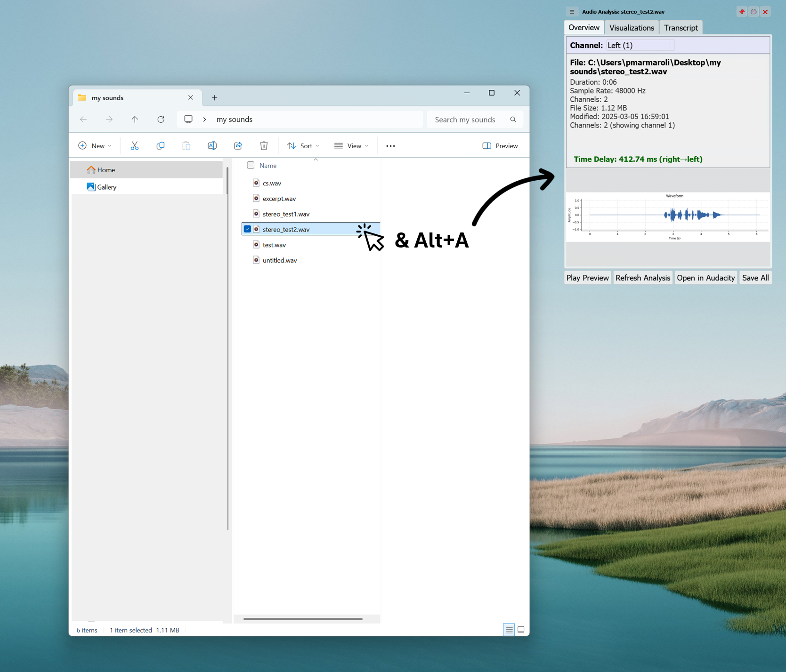
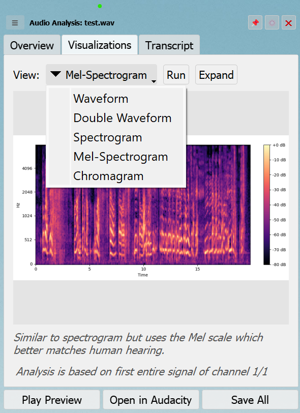

# Audio Tooltip

Audio Tooltip is a desktop application that gives you quick information on audio files without needing to open complex audio editing software.

## What It Does

The app runs quietly in your system tray (the small icons area near your clock) and gives you instant information about audio files with a simple keyboard shortcut (Alt+A). When you select an audio file and press this shortcut, a small window (tooltip) pops up showing:

1. Basic information about the audio file (length, format, etc.)
2. Visual representations of the sound (waveforms and spectrograms)
3. Written transcript of any speech in the audio (like subtitles)

## How To Use It

There are several ways to analyze audio files:

1. **Keyboard shortcut**: Select a file in Windows Explorer and press Alt+A
2. **Middle-click detection**: Middle-click any audio file in Windows Explorer
3. **System tray**: Right-click the app's icon for menu, middle-click for quick file dialog
4. **Drop target window**: Press Alt+D to open a drop target window and drag-and-drop audio files onto it

## Watch our Youtube Demo

[](http://www.youtube.com/watch?v=xclEy1SetjA "Video Title")

## Main Features

- **Overview**: Basic information and waveform display.
- **Visualizations**: Various audio visualizations (spectrogram, mel-spectrogram, chromagram, double waveform)
- **Full Audio Transcription**: Speech-to-text via Azure Speech Services with continuous recognition for files of any length
- **Simple interface**: Everything is organized in tabs for easy navigation

Additional controls:

- Play a short preview of the audio
- Open the full file in Audacity or your default audio player
- Pin the tooltip to keep it visible
- Switch between channels for multi-channel audio
- Save analysis results to files

## Keyboard Shortcuts

- **Alt+A**: Analyze the currently selected audio file in Windows Explorer
- **Alt+D**: Open the drop target window for drag-and-drop file analysis

## Why It's Useful

We hope this tool can be helpful for:

- Audio engineers wanting quick insights into sound files
- Podcast editors checking audio quality before detailed editing
- Musicians analyzing sound characteristics
- Anyone who works with audio and needs quick information without opening large programs

## Application Interface




## Project Structure

```
AudioTooltip/
│
├── core/                      # Core analysis functionality
│   ├── audio_analyzer.py      # Audio loading, analysis, feature extraction, transcription
│   └── audio_playback.py      # Audio playback functionality
│
├── ui/                        # User interface components
│   ├── tooltip.py             # Main tooltip display
│   ├── settings_dialog.py     # Settings configuration
│   └── progress_dialog.py     # Progress indicators
│
├── utils/                     # Utility functions
│   ├── file_utils.py          # File handling and audio extension detection
│   ├── logging_utils.py       # Logging configuration
│   └── startup_utils.py       # Windows startup management
│
├── resources/                 # Application resources
│   └── icons/                 # Application icons
│
├── main.py                    # Application entry point
├── build_release.bat          # Release build script
├── cleanup.ps1                # Uninstall/cleanup script
├── AudioTooltip.spec          # PyInstaller spec file
├── README.md                  # Project documentation
├── installation-guide.md      # Post-install user guide
└── requirements.txt           # Python dependencies
```

## System Requirements

### Operating System
- **Windows 7 or later** (Windows 10/11 recommended)
- **macOS and Linux are NOT supported**

AudioTooltip is designed specifically for Windows and uses Windows-specific features that are not available on other operating systems:
- Windows Registry integration for auto-startup
- Windows API integration for File Explorer interaction
- Windows COM objects for shell integration
- Windows system tray functionality
- Windows-specific hotkey handling

### Hardware Requirements
- **RAM:** 4GB minimum (8GB recommended for large audio files)
- **Storage:** 100MB for application + additional space for temporary files during analysis
- **Audio:** Sound card or audio device (for audio playback features)
- **Display:** Any resolution (application adapts to screen size)

### Software Dependencies (Pre-built Version)
The pre-built executable includes all necessary dependencies. No additional software installation required.

### Optional Features
- **Azure Speech Services account** (for speech transcription features)
- **Audacity** (for "Open in Audacity" feature - automatically detected if installed)

## Installation

### Option 1: Download the Pre-built Release

1. Go to the [Releases page](https://github.com/pmarmaroli/AudioTooltip/releases)
2. Download the latest version
3. Extract the ZIP file
4. Run AudioTooltip.exe

### Option 2: Build from Source

#### Requirements

- Python 3.11+
- See `requirements.txt` for the full pinned dependency list

Key packages: `PyQt5`, `librosa`, `numpy`, `matplotlib`, `soundfile`, `mutagen`, `azure-cognitiveservices-speech`, `pywin32`, `keyboard`, `pynput`

#### Setup

1. Clone the repository:

```bash
git clone https://github.com/pmarmaroli/AudioTooltip.git
cd AudioTooltip
```

2. Install dependencies:

```bash
pip install -r requirements.txt
```

3. Launch the application:

```bash
python main.py
```

4. Or build your own executable — see [Creating a Release](#creating-a-release) below.

## Creating a Release

Follow this checklist in order each time you cut a new release.

### Versioning scheme

This project uses **Semantic Versioning** (`MAJOR.MINOR.PATCH`):

| Bump | When to use | Example |
|------|-------------|---------|
| PATCH | Bug fixes only, no new features | 3.0.0 → 3.0.1 |
| MINOR | New features, fully backwards compatible | 3.0.0 → 3.1.0 |
| MAJOR | Breaking changes or significant rewrites | 3.0.0 → 4.0.0 |

**Decide the new version number before starting the steps below.** The version drives the git tag, the splash screen string, and the release notes — everything must be consistent.

### 1. Bump the version string

Open `main.py` and find the splash screen painter line (around line 2015):

```python
painter.drawText(20, 80, "v3.0.0 - Audio Analysis Tool")
```

Change `v3.0.0` to the new version number. Save the file.

### 2. Build the executable

Double-click `build_release.bat`, or run it from any terminal — the script always `cd`s to its own directory first, so the working directory does not matter.

The script will:
- Verify Python 3.11 is installed (attempts `winget` install if not found)
- Create `.venv` in the project root if it does not exist
- Install all `requirements.txt` dependencies into the venv
- Install PyInstaller into the venv if not present
- Run `python -m PyInstaller AudioTooltip.spec --clean`
- Copy `cleanup.ps1` and `installation-guide.md` into `dist/`

Output: `dist/AudioTooltip.exe` (plus `cleanup.ps1` and `installation-guide.md` in the same folder).

> **Note:** Do not run `pip install pyinstaller` manually beforehand — the script handles this inside the venv.

### 3. Verify the build

- Confirm `dist/AudioTooltip.exe` exists.
- Launch `dist/AudioTooltip.exe` and check that the splash screen shows the correct version number.
- Confirm `dist/cleanup.ps1` and `dist/installation-guide.md` are present.

### 4. Package and publish

1. Zip the contents of `dist/` (not the folder itself — users should be able to unzip and run directly):

   ```
   AudioTooltip.exe
   cleanup.ps1
   installation-guide.md
   ```

2. Commit the version bump:

   ```bash
   git add main.py
   git commit -m "chore: bump version to vX.Y.Z"
   ```

3. Tag the release and push:

   ```bash
   git tag vX.Y.Z
   git push origin main --tags
   ```

4. Create a GitHub release at [https://github.com/pmarmaroli/AudioTooltip/releases/new](https://github.com/pmarmaroli/AudioTooltip/releases/new), select the tag, and upload the zip file.

---

## Development

### Extending the Application

The modular architecture makes it easy to extend:

- Add new visualization types in `core/audio_analyzer.py`
- Enhance the UI by modifying components in the `ui/` directory

## Troubleshooting

Logs are stored in:

- `%LOCALAPPDATA%\AudioTooltip_Logs\`

Logging is disabled by default. Enable it in Settings > General > "Enable application logging".

Common issues:

- **Missing dependencies**: Ensure all packages in requirements.txt are installed
- **Hotkeys not working**: Make sure the virtual environment is activated when running from source
- **Audio file not recognized**: Check if the file format is supported. Supported extensions: `.mp3`, `.wav`, `.flac`, `.m4a`, `.ogg`, `.wma`, `.aac`, `.aiff`, `.mp4`, `.ape`, `.opus`, `.wv`
- **Network files not accessible**: UNC network paths may have issues; try copying files locally first
- **Transcription unavailable**: Verify Azure credentials in settings
- **Incomplete transcription**: Ensure "Full file" is selected in transcription duration settings
- **Windows security warning**: Follow the steps outlined in the security warning section

## Additional Documentation

- [Installation Guide](installation-guide.md) — Windows SmartScreen warning, detailed feature walkthrough, configuration reference, startup behavior, and uninstall instructions

## Need Help?

If you encounter any issues or have questions, please contact support at [patrick.marmaroli@gmail.com] or visit our GitHub repository at [https://github.com/pmarmaroli/AudioTooltip](https://github.com/pmarmaroli/AudioTooltip).

## Developers

- [Patrick Marmaroli](https://www.linkedin.com/in/pmarmaroli/) - Developer
- [Ergo Esken](https://www.linkedin.com/in/ergo-esken/) - QA Auditor

## License

[MIT License](LICENSE)

## Acknowledgements

This application uses several open-source libraries:

- librosa for audio analysis
- PyQt5 for the user interface
- matplotlib for visualizations
- soundfile for audio file handling
- Azure Cognitive Services for speech recognition
